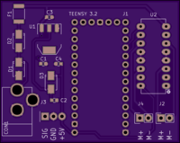
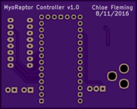

# myoraptor-controller
A PCB shield for controlling the Raptor Reloaded 3D printed prosthetic with the MyoWare EMG sensor.

## Board Previews
(Courtesy of OSH Park)  

## Bill of Materials
|Ref|Quantity|Digikey Part Number|Manufacturer Part Number|Description|
|---|--------|-------------------|------------------------|-----------|
|U2|1|296-9911-5-ND|SN754410NE|IC HALF-H DRVR QUAD 16-DIP|
|J2, J4|2|ED10561-ND|OSTVN02A150|CONN TERM BLOCK 2.54MM 2POS PCB|
|J3|1|OSTVN03A150|OSTVN03A150|CONN TERM BLOCK 2.54MM 3POS PCB|
|D1|1|SMAJ14A-FDICT-ND|SMAJ14A-13-F|TVS DIODE 14VWM 23.2VC SMA|
|U1|1|NCP1117LPST50T3GOSCT-ND|NCP1117LPST50T3G|IC REG LDO 5V 1A SOT223|
|F1|1|MF-MSMF110/24X-2CT-ND|MF-MSMF110/24X-2|FUSE PTC RESET 1.10A SMD 1812|
|D2, D3|2|SS12-E3/61TGICT-ND|SS12-E3/61T|DIODE SCHOTTKY 20V 1A DO214AC|
|C4|1|490-1519-1-ND|GRM188R71H104KA93D|CAP CER 0.1UF 50V X7R 0603|
|C3|1|490-5307-1-ND|GRM188R71E105KA12D|CAP CER 1UF 25V X7R 0603|
|C1, C2|2|490-7202-1-ND|GRM188R61E106MA73D|CAP CER 10UF 25V X5R 0603|
|J1|1|||Teensy 3.2|
